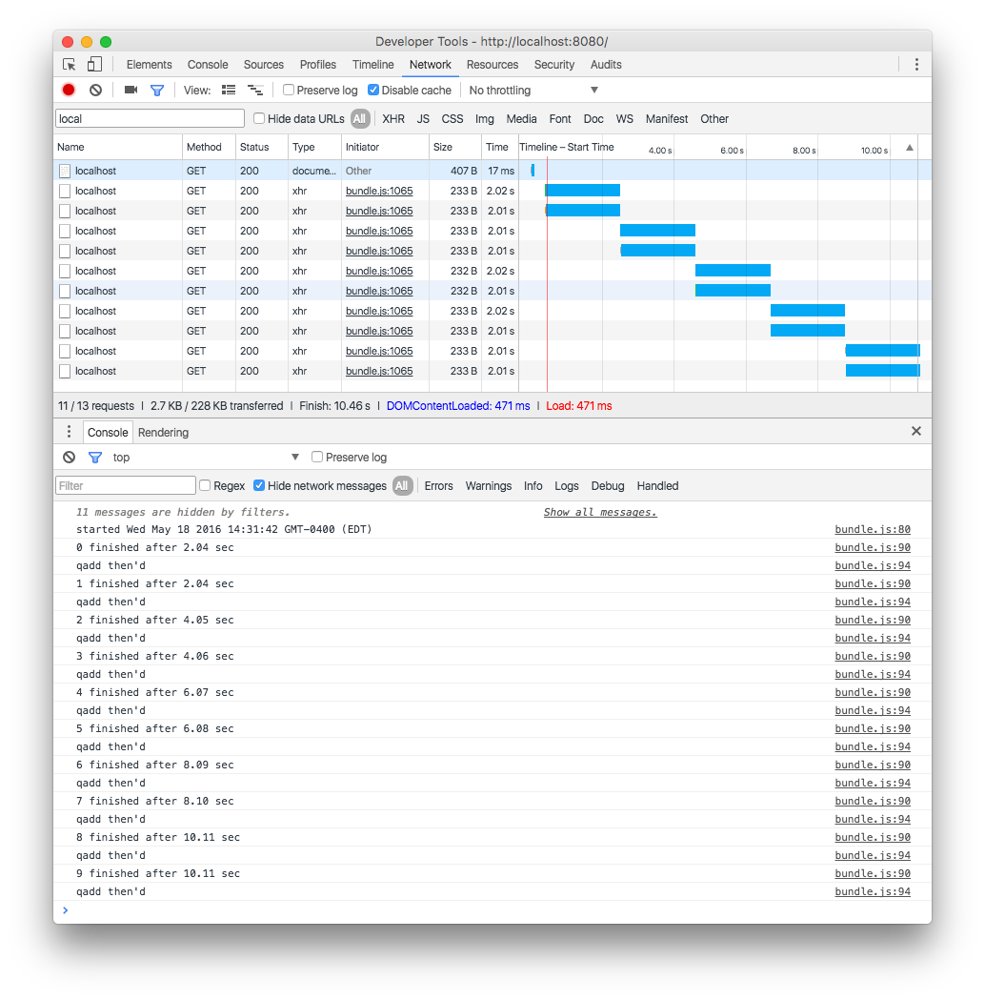

# promise-pool-testing

Investigation into how to use AJAX requests and promises on front-end in a pool/queue with limited concurrency.

Includes a dummy local non-blocking Python/Tornado server to test concurrent requests.

The great [promise-queue](https://github.com/azproduction/promise-queue) library is used.

### Installing

```bash
pip install -r requirements.txt
npm install
```

### Running
```bash
python tornadoserver.py
npm start # and point browser to localhost:8080
```

### Example
Concurrency: 2

